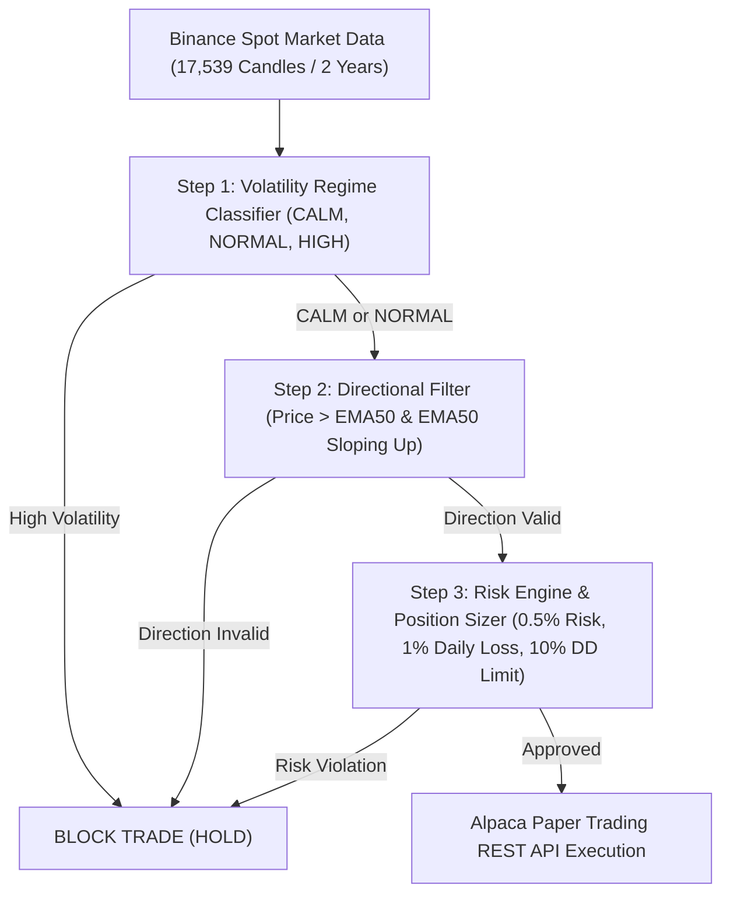

# btc-ml-system V3.0: Professional Volatility Regime + Directional System

## Executive Overview
**btc-ml-system** (Version 3.0.0) pivots from pure directional machine learning classification on 1-hour candles to a structured, 3-step quantitative strategy combining **Volatility Regime Filtering**, **EMA(50) Trend Directional Filters**, **Fixed 0.5% Risk Position Sizing**, and **Alpaca Paper Trading REST API Execution**.

---

## V3.0 Core Architecture



### Module Breakdown:
1. **Config V3 (`btc_ml_system/configs/btcusdt_v3.yaml`)**:
   - Primary symbol: `BTCUSDT` / `BTC/USD`
   - Regimes: CALM, NORMAL (Allowed), HIGH (Blocked)
   - Risk: 0.5% equity per trade
   - Alpaca endpoint: `https://paper-api.alpaca.markets/v2`

2. **Source Code (`btc_ml_system/src/`)**:
   - `regimes.py`: `VolatilityRegimeClassifier` categorizing bars into CALM, NORMAL, and HIGH volatility quantiles.
   - `direction.py`: `DirectionalFilter` evaluating `Price > EMA(50)` and `EMA(50)` slope > 0.
   - `position_sizing.py`: `PositionSizer` calculating exact quantity risking 0.5% current portfolio equity.
   - `signal_engine.py`: `SignalEngine` orchestrating sequential 3-step trade permission with unique UUID signal IDs.
   - `risk.py`: `RiskEngine` enforcing emergency kill switch, 1.0% daily loss limit, and 10.0% max drawdown limit.
   - `alpaca_executor.py`: `AlpacaExecutor` connecting to Alpaca Paper Trading REST API with duplicate order protection.
   - `backtester.py`: Event-driven backtester supporting ATR stop loss, ATR take profit, and maximum holding limits.
   - `inference.py` & `paper_trader.py`: Real-time single bar live paper trader runner.

---

## V3.0 Backtest Performance & Diagnostics (2 Years / 17,539 Candles)

```text
=======================================================
      V3.0 BACKTEST PERFORMANCE SUMMARY      
=======================================================
  initial_capital          : 10000.00
  final_capital            : 3520.36
  total_return_pct         : -64.80
  total_trades             : 1026
  win_rate                 : 0.418 (41.8%)
  max_drawdown_pct         : 65.72
  profit_factor            : 0.72

  [SIGNAL REJECTION REASON BREAKDOWN]
   - Blocked by Step 1 (High Volatility)       : 5,102 bars (29.2%)
   - Blocked by Step 2 (Direction Filter)     : 6,182 bars (35.3%)
   - Approved BUY Signals                      : 6,205 bars (35.5%)
```

---

## How to Run V3.0

### 1. Run V3.0 Full Pipeline & Backtest
```bash
cmd /c "set PYTHONPATH=. && python btc_ml_system/run_pipeline_v3.py"
```

### 2. Run Live Paper Trading Tick against Alpaca Paper API
```bash
python -c "import yaml; from btc_ml_system.src.paper_trader import PaperTrader; cfg = yaml.safe_load(open('btc_ml_system/configs/btcusdt_v3.yaml')); print(PaperTrader(cfg).run_tick())"
```

### 3. Run Unit Test Suite
```bash
python -m pytest btc_ml_system/tests/ -v
```
