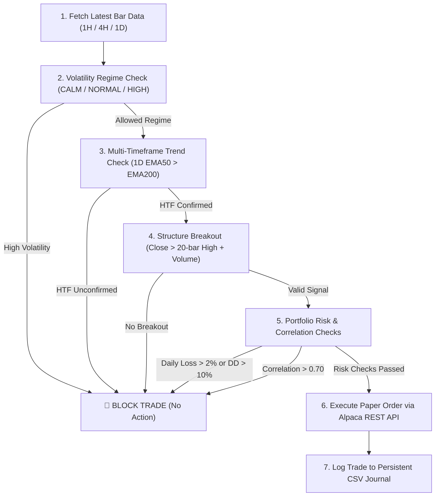

# 🚀 btc-ml-system (Portfolio Mode V5.0)

> **Institutional-Grade Multi-Asset Quantitative Trading & Risk Management Engine**  
> *Seamlessly combining US Equities, Bitcoin, and Ethereum with Volatility Regime Classification, Multi-Timeframe Trend Confirmation, Rolling Correlation Controls, and Alpaca Paper Trading REST API Execution.*

---

## 💡 Executive Summary (The Big Picture)

### What is `btc-ml-system`?
Imagine an automated, algorithmic fund manager running on your machine 24/7. Instead of manually watching charts and guessing when to buy or sell, **`btc-ml-system`** follows a rigorous, mathematical quantitative process:

1. **Analyzes Market Data** across 7 core assets (`AAPL`, `MSFT`, `NVDA`, `TSLA`, `AMZN`, `BTCUSDT`, `ETHUSDT`).
2. **Filters Out Bad Market Regimes** using Volatility Quantiles and Higher-Timeframe Trend Filters so you never buy during high-volatility crashes or macro downtrends.
3. **Calculates Exact Position Sizes** based on strict risk limits (risking a maximum of 0.5% portfolio equity per trade).
4. **Enforces Portfolio Circuit Breakers** (Max 3.0% open risk, 2.0% daily loss limit, 10.0% max drawdown).
5. **Executes Automated Paper Orders** directly via the Alpaca REST API with zero manual intervention.

---

## 🛠️ Tech Stack & Technologies Used

| Category | Technology | Purpose in System |
| :--- | :--- | :--- |
| **Core Logic** | `Python 3.10+` | Primary programming language for pipeline orchestration |
| **Data Processing** | `Pandas`, `NumPy` | High-performance vector calculations, candle parsing, rolling stats |
| **Machine Learning** | `Scikit-learn` | Volatility regime classification & meta-labeling classifiers |
| **Broker REST API** | `Alpaca Markets API v2` | Live/paper market account queries, order submission & position tracking |
| **Data Providers** | `Binance Public API`, `Alpaca Data API` | Real-time and historical kline/candle data ingestion |
| **Configuration** | `PyYAML` | Fully modular, human-readable YAML strategy parameters |
| **Testing & Audit** | `Pytest` | Automated unit test suite verifying signal generation & risk engines |

---

## 📊 Portfolio Allocation Architecture (Portfolio V5.0)

The portfolio spreads capital across **7 core assets** divided into 3 independent strategy components:

```text
                          ┌─────────────────────────────────────────┐
                          │   TOTAL PORTFOLIO CAPITAL ($10,000)     │
                          └────────────────────┬────────────────────┘
                                               │
           ┌───────────────────────────────────┼───────────────────────────────────┐
           │ (50% Weight)                      │ (25% Weight)                      │ (25% Weight)
           ▼                                   ▼                                   ▼
┌──────────────────────┐            ┌──────────────────────┐            ┌──────────────────────┐
│  EQUITIES BASKET     │            │    BITCOIN (4H)      │            │    ETHEREUM (1H)     │
│  (AAPL, MSFT, NVDA,  │            │  (MTF Medium +       │            │  (Clean Trend        │
│   TSLA, AMZN)        │            │   NORMAL Regime)     │            │   Momentum)          │
│  [10% Each / Frozen] │            │  [25% Allocation]    │            │  [25% Allocation]    │
└──────────────────────┘            └──────────────────────┘            └──────────────────────┘
```

---

## 🔄 End-to-End Decision Flowchart

When the system runs every 30 seconds, here is the exact step-by-step pipeline each asset passes through:


```mermaid
flowchart TD
    Start["1. Fetch Latest Bar Data (1H / 4H / 1D)"] --> VolRegime["2. Volatility Regime Check (CALM / NORMAL / HIGH)"]
    
    VolRegime -->|High Volatility| Block["🚫 BLOCK TRADE (No Action)"]
    VolRegime -->|Allowed Regime| MTFCheck["3. Multi-Timeframe Trend Check (1D EMA50 > EMA200)"]
    
    MTFCheck -->|HTF Unconfirmed| Block
    MTFCheck -->|HTF Confirmed| StructBreak["4. Structure Breakout (Close > 20-bar High + Volume)"]
    
    StructBreak -->|No Breakout| Block
    StructBreak -->|Valid Signal| RiskEngine["5. Portfolio Risk & Correlation Checks"]
    
    RiskEngine -->|Daily Loss > 2% or DD > 10%| Block
    RiskEngine -->|Correlation > 0.70| Block
    RiskEngine -->|Risk Checks Passed| OrderExec["6. Execute Paper Order via Alpaca REST API"]
    OrderExec --> Journal["7. Log Trade to Persistent CSV Journal"]
```

---

## 🛡️ Portfolio Risk Controls & Circuit Breakers

To protect your capital against black swan crashes or bad market conditions:

1. **Fixed 0.5% Trade Risk Sizing**: Position size is calculated dynamically based on stop-loss distance so no single trade risks more than 0.5% of component equity.
2. **3.0% Max Open Dollar Risk**: Combined dollar risk across all open positions cannot exceed 3.0% of total portfolio equity.
3. **2.0% Daily Loss Limit**: If total daily losses hit 2.0%, all new entry orders are automatically blocked for the day.
4. **10.0% Max Drawdown Circuit Breaker**: If equity drops 10.0% from peak, a system-wide circuit breaker triggers.
5. **Rolling Pairwise Correlation Filter ($\le 0.70$)**: Calculates a 30-bar rolling return correlation matrix. If a candidate asset has $> 0.70$ correlation with an active open position, the trade is blocked to avoid over-exposure.
6. **Hard Position Size Limit ($2,500 / 30\%$)**: Individual position value is hard-capped at $2,500 or 30% of portfolio equity.

---

## 🚀 Quickstart & Execution Guide

### 1. Environment Setup

Clone the repository and install requirements:
```bash
git clone https://github.com/<YOUR_USERNAME>/BTC_ML_System.git
cd BTC_ML_System
pip install -r btc_ml_system/requirements.txt
```

### 2. Configure Alpaca Paper API Keys

Set your Alpaca Paper Trading API keys in your terminal environment:

#### Windows PowerShell:
```powershell
$env:ALPACA_API_KEY="YOUR_ALPACA_API_KEY_HERE"
$env:ALPACA_SECRET_KEY="YOUR_ALPACA_SECRET_KEY_HERE"
```

#### Linux / macOS:
```bash
export ALPACA_API_KEY="YOUR_ALPACA_API_KEY_HERE"
export ALPACA_SECRET_KEY="YOUR_ALPACA_SECRET_KEY_HERE"
```

*Note: You can also specify keys directly in `btc_ml_system/configs/portfolio_paper_v5.yaml`.*

---

### 3. How to Run Historical Backtests

Run the full portfolio historical backtest engine across 2 years of market data:
```bash
python btc_ml_system/run_pipeline_v5.0.py
```

Run the regime and exit optimization audit suite:
```bash
python btc_ml_system/run_pipeline_v5.1.py
```

---

### 4. How to Run Live Alpaca Paper Trading

#### A. Start Continuous 30-Second Live Monitoring Loop
```bash
python btc_ml_system/run_paper_portfolio_v5.py
```

#### B. Run in Dry-Run Mode (Mock Execution without HTTP calls)
```bash
python btc_ml_system/run_paper_portfolio_v5.py --dry-run
```

#### C. View Daily Portfolio Summary Report
```bash
python btc_ml_system/run_paper_portfolio_v5.py --summary
```

#### D. Emergency Kill Switch (Flatten All Positions & Cancel Orders)
```bash
python btc_ml_system/run_paper_portfolio_v5.py --flatten
```

---

## 📁 Repository Structure

```text
BTC_ML_System/
├── README.md                           # Master Project Architecture & Usage Guide
└── btc_ml_system/
    ├── configs/                        # YAML Strategy Configuration Files
    │   ├── portfolio_paper_v5.yaml     # Dedicated Alpaca Paper Trading Config
    │   ├── portfolio_v5.yaml           # Historical Portfolio Backtest Config
    │   ├── aapl_v4.3.yaml              # Apple Equity Config
    │   ├── btc_4h_v4.5.yaml            # Bitcoin 4H Strategy Config
    │   └── eth_1h_v4.5.yaml            # Ethereum 1H Strategy Config
    ├── src/                            # Core Algorithmic Source Code
    │   ├── alpaca_executor.py          # Alpaca REST API Order Execution Engine
    │   ├── portfolio_paper_trader.py   # Multi-Asset Live Paper Trading Orchestrator
    │   ├── portfolio_manager.py        # Multi-Asset Combined Backtest Engine
    │   ├── signal_engine.py            # Sequential Signal Generator
    │   ├── direction.py                # Market Structure & MTF Trend Filters
    │   ├── regimes.py                  # Volatility Regime Classifier
    │   ├── risk.py                     # Risk Control & Circuit Breakers
    │   ├── position_sizing.py          # Fixed Risk Position Sizer
    │   ├── data_provider.py            # Data Ingestion & Caching Layer
    │   └── backtester.py               # Event-Driven Backtest Simulator
    ├── run_paper_portfolio_v5.py       # Live Alpaca Paper Trading Entrypoint
    ├── run_pipeline_v5.0.py            # Portfolio V5.0 Backtest Runner
    └── run_pipeline_v5.1.py            # Diagnostic Audit Runner
```
